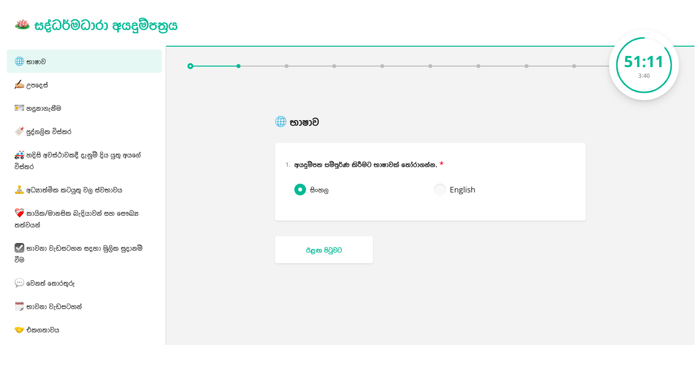
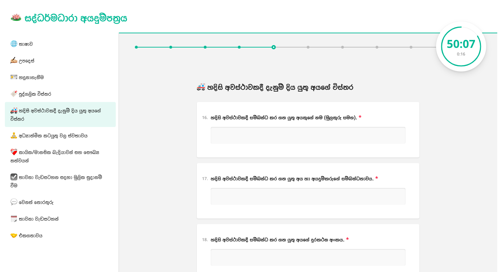
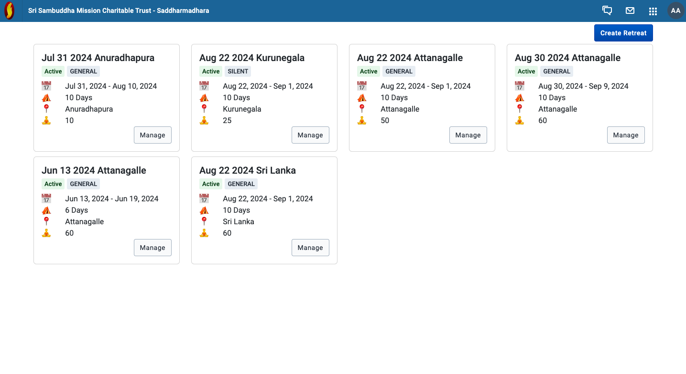
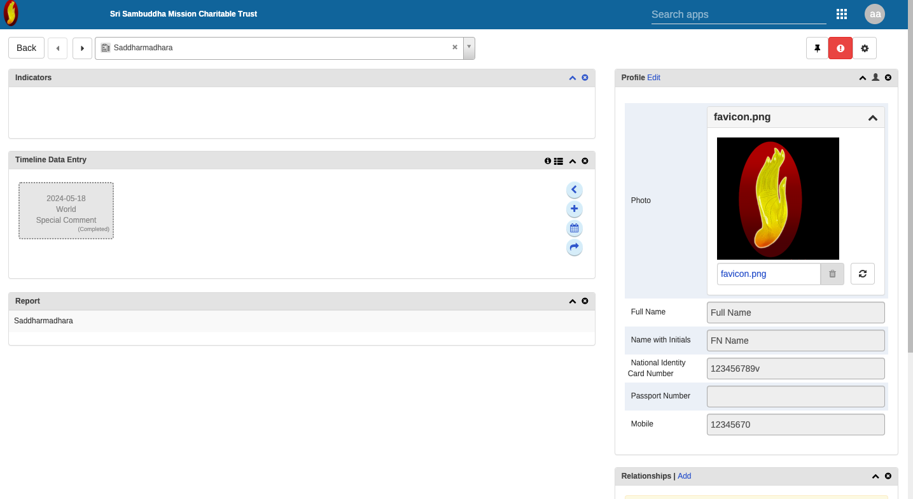
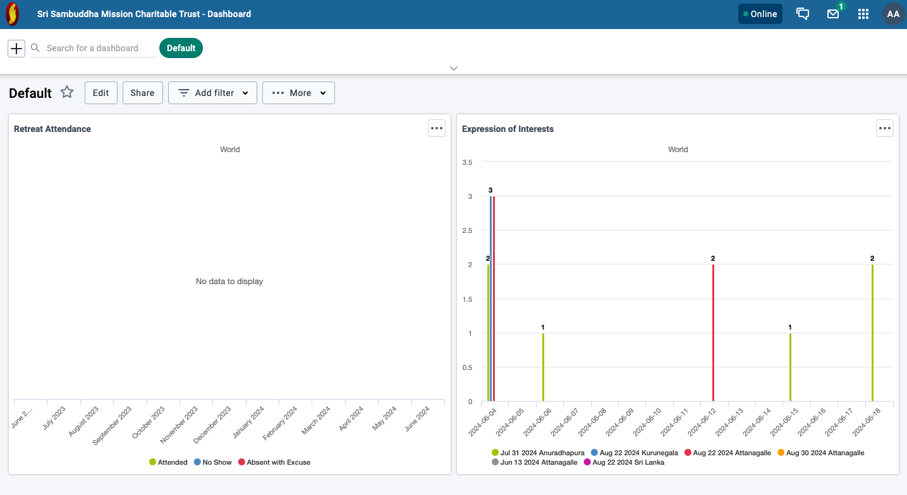

# Saddharmadhara

This application was developed to manage applicants for meditation programs conducted by the Most Venerable Bambalapitiya Gnanaloka Thero.

For more information, visit: [Sri Sambuddha Mission](https://srisambuddhamission.org/saddharmadhara/)

Developed as a charity project, this application is available for similar purposes aimed at protecting and fostering the Buddha Sasana, and preserving the pristine teachings of the Lord Buddha as enshrined in the Pali Tipitaka of Theravada Buddhism.

If you have a similar requirement and have similar [objects](https://srisambuddhamission.org/objects-of-the-trust/), please contact me, Chathura Widanage, or the [Sri Sambuddha Mission Charitable Trust](https://srisambuddhamission.org/contact/). Any additional development, installation, maintenance, and training needed will be provided free of charge.

**May this effort help guide more people towards the supreme bliss of Nibbana.**

### Features

- Bilingual Yogi Application
- Streamlined Retreat Management and Yogi Selection
- Yogi Profile
- Search and Filtering
- Yogi attendance logging

Future work

- Room allocation for Yogis
- Semi automated application selection

### Screenshots

---

[Deployment and technical details](docs/deployment/README.md)
